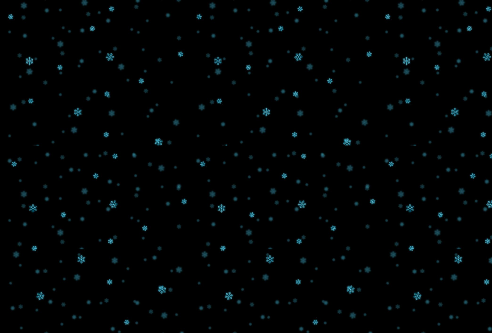

# LetItSnow
LESS / CSS only snowfall animation

**Online preview**:

https://snow.wufr.cz/

**Screenshot:**

## How to use in your project:

- A) Copy styles from `css/` and images from `img/` into your project and modify paths to images if needed.
- B) Build from source less files by including `less/router.less` file in your project. Additionally you can override default configuration with your own.
